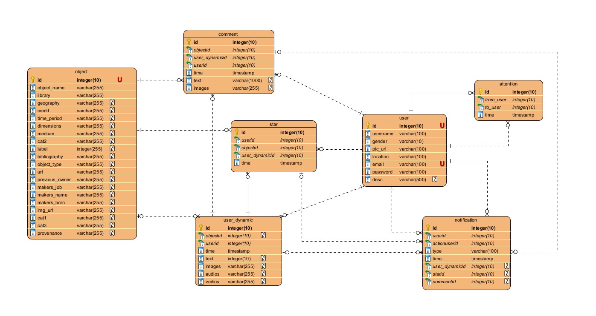

## 数据库设计

### ER模型图：

#### 用户表（user）

+ id
+ 用户名（username）
+ 头像图片地址（pic_url）
+ 性别（gender）
+ 所属地（location）
+ 邮箱（email）
+ 密码（password)
+ 描述（desc）（**可为空**）

#### 用户动态表（user_dynamic）

+ id
+ 用户（user_id）(**FK**)
+ 动态发布时间（time）
+ 内容（text）(**可为空**，即只图片动态)
+ 动态文件（files_urls）（**可为空**，即只内容动态）
+ 文物（object_id）(**FK**) (**可为空**，为空时为不针对具体文物的动态，不为空时为针对具体文物的动态)

#### 评论表 (comment)

+ id
+ 文物 （object_id）（**FK**）(**可为空**， 不为空时为文物评论)
+ 动态（dynamic_id）（**FK**）（**可为空**，不为空时为动态评论）
+ 评论（comment_id）(**FK**)（**可为空**，不为空时为评论回复）
+ 用户（user_id） (**FK**)
+ 回复用户（reply_user）(**FK**) （**可为空**，不为空时为该评论回复的用户）
+ 评论时间（time）
+ 评论内容 （text）（**可为空**，即只图片评论）
+ 图片内容（images）（**可为空**，即只文本评论）

#### 点赞表（star）

+ id
+ 动态（dynamic_id）(**FK**)， （**可为空**，不为空时为动态点赞）
+ 文物（object_id）(**FK**) （**可为空**, 不为空时为文物点赞）、
+ 评论（comment_id）(**FK**)（**可为空**，不为空时为评论点赞）
+ 用户（user_id）(**FK**)
+ 点赞时间（time）

#### 用户关注表 (attention) (自关联)

+ id
+ 关注用户（from_user）（**FK**）
+ 被关注用户（to_user）(**FK**)
+ 关注时间（time）

#### 用户通知表（notification）（**自关联**）

+ id 
+ 用户（user_id）（**FK**）
+ 通知类型（type）：关注了你，评论了你，赞了你，回复了你
+ 动作用户（action_user_id）(**FK**)
+ 评论（comment_id）(**FK**)
+ 点赞（star_id）(**FK**) (**可为空**)
+ 评论 （comment_id）(**FK**) (**可为空**)
+ 是否已读（read）